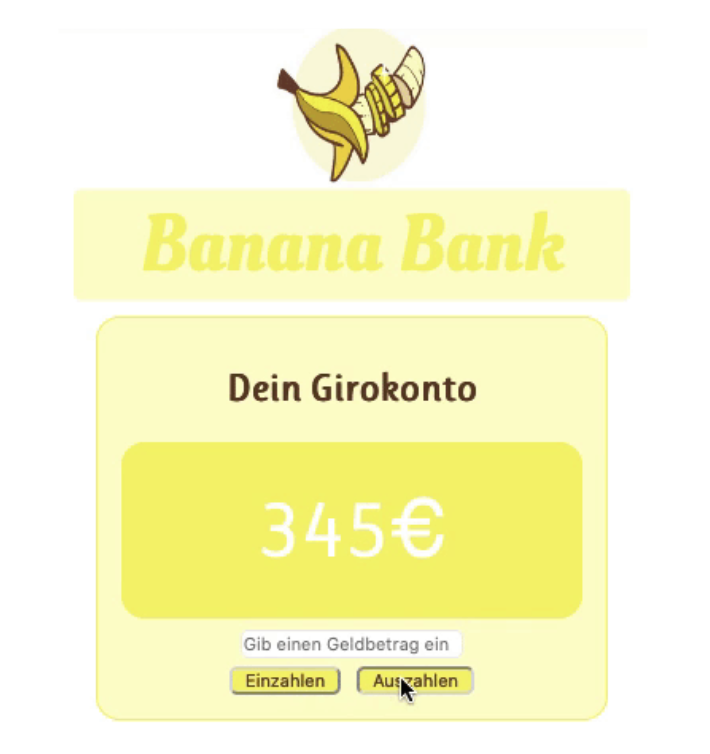
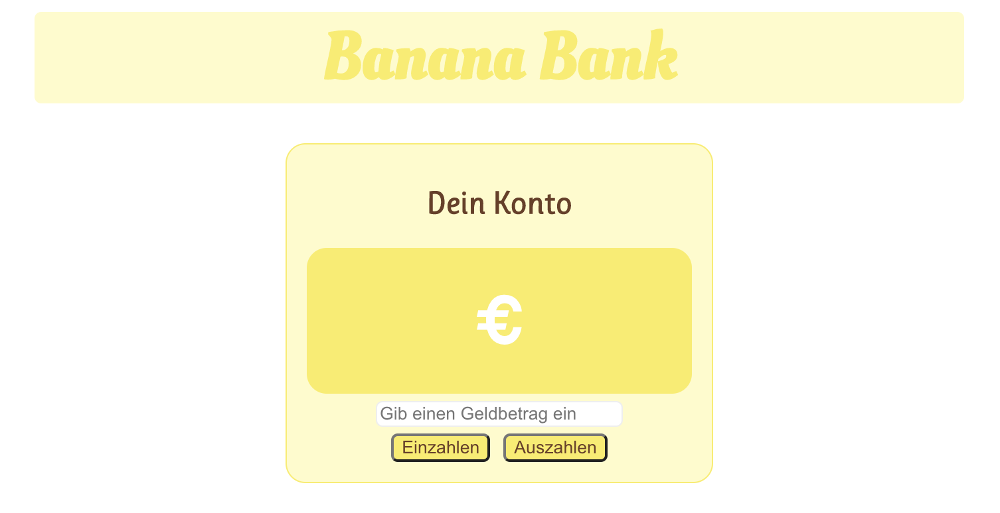

## React – lev3_3_projekt_js-reactjs_banana-bank

Eine Übung im SuperCode Bootcamp

## 🎓 Aufgabe

Du arbeitest in einer Bank. Nun hat dein Chef beschlossen, dass die gesamte Website in React neu programmiert werden muss. Unsere Aufgabe ist es, eine Komponente für Ein- und Auszahlungen des Kontos zu erstellen.
Die Komponente soll folgendes anzeigen:

Den aktuellen Kontostand des Kunden.
Ein Eingabefeld, in dem ein Geldbetrag eingeben werden kann.
Einen Button zum [Einzahlen].
Einen Button zum [Auszahlen].

Wenn ein Button geklickt wird, ändert sich der Kontostand entsprechend der Summe im Eingabefeld.

## 📸 Screenshots Aufgabe

## 📸 Screenshots Lösung

<h3 align="left">Languages and Tools:</h3>

 
 
 

