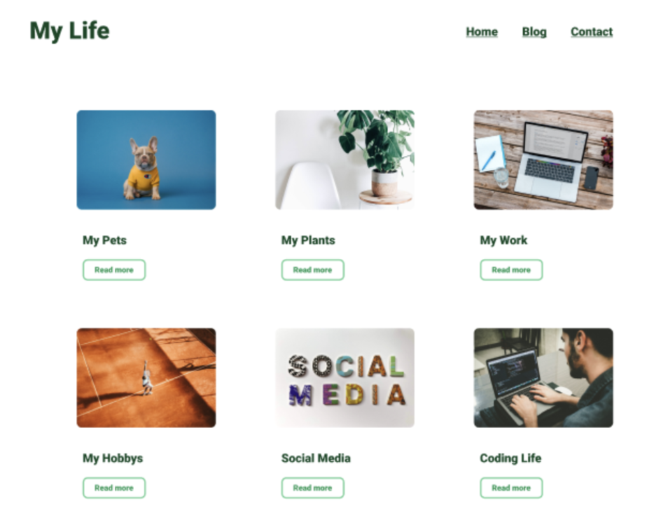
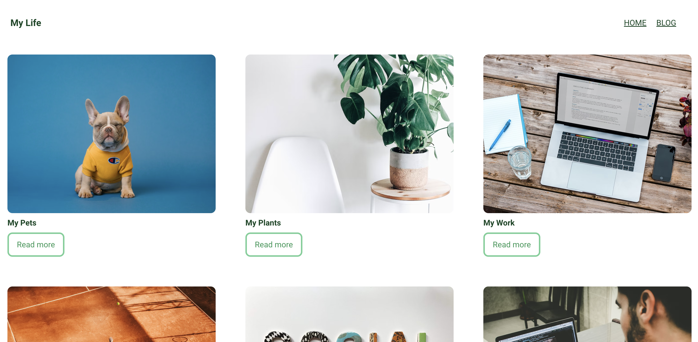

## React – lev2_2_js-reactjs_router_simple-blog

Eine Übung im SuperCode Bootcamp

## 🎓 Aufgabe

Heute wollen wir eine simple Blog Website erstellen.

## 📸 Screenshots Aufgabe

## 📸 Screenshots Lösung

<h3 align="left">Languages and Tools:</h3>

 
 

